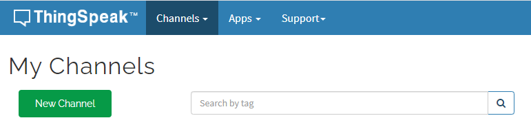
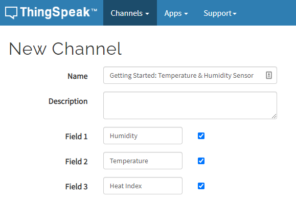
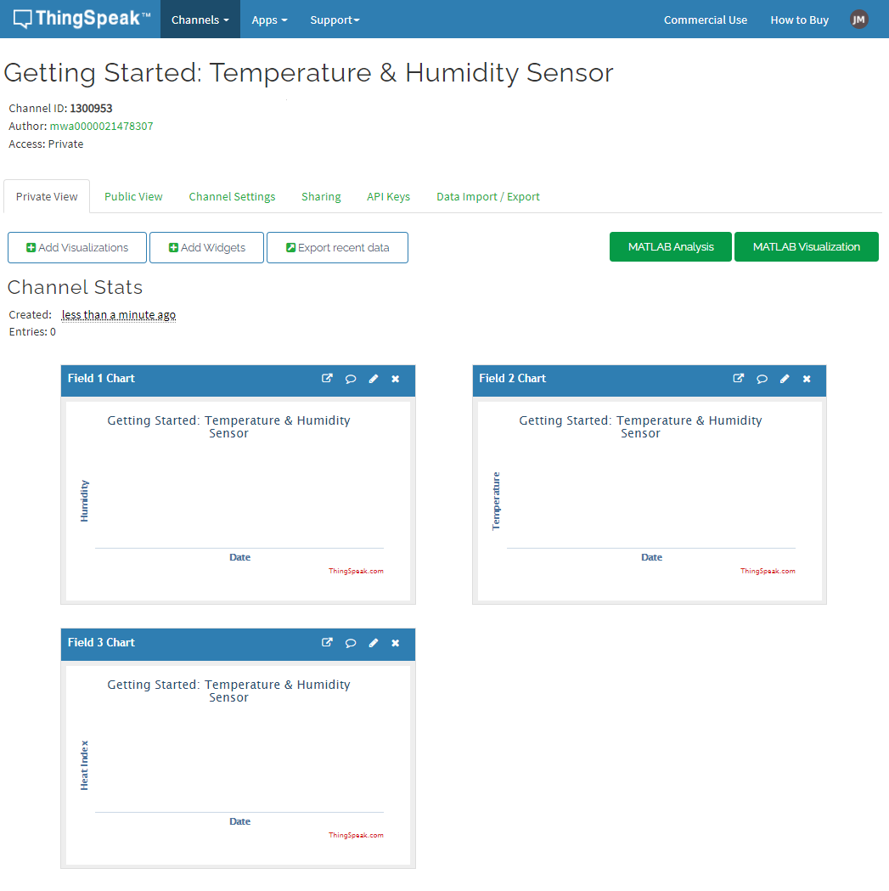
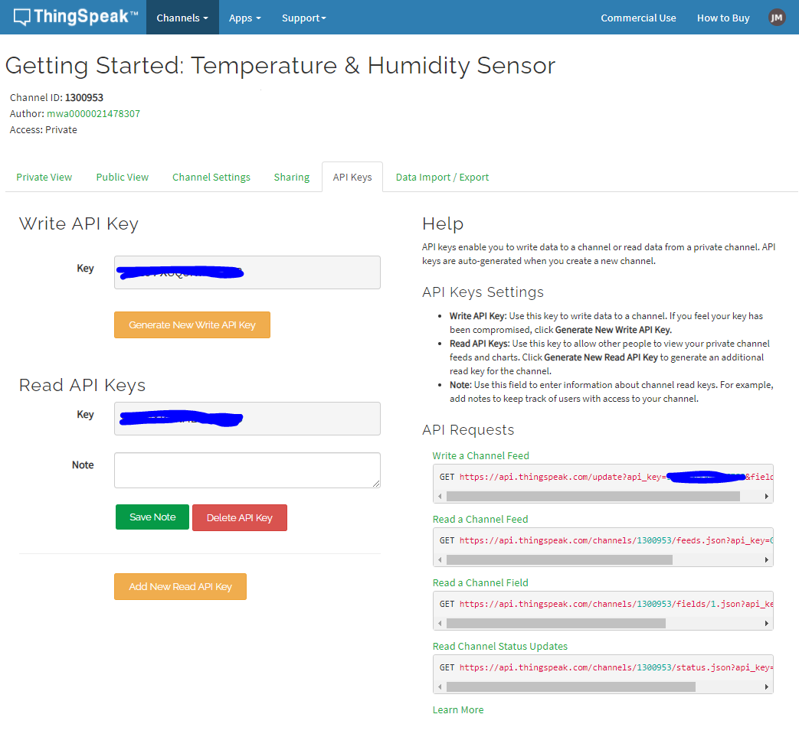
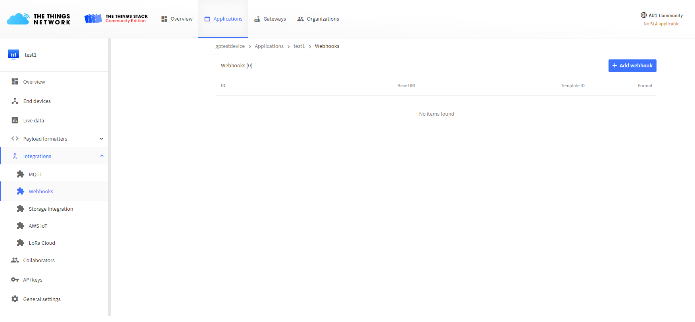
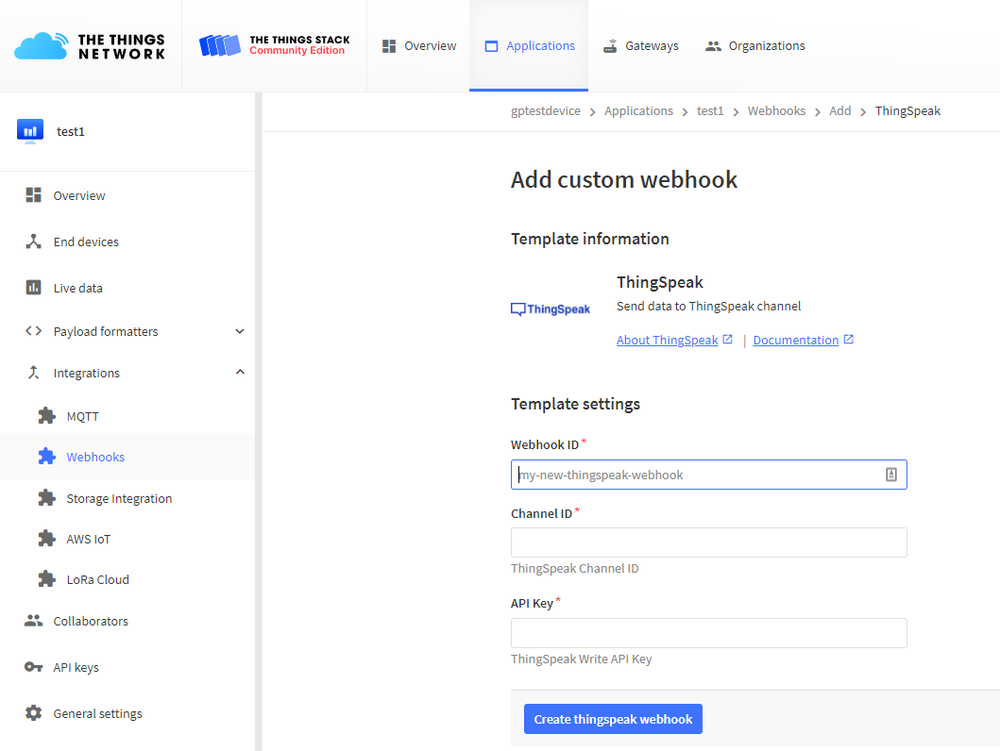
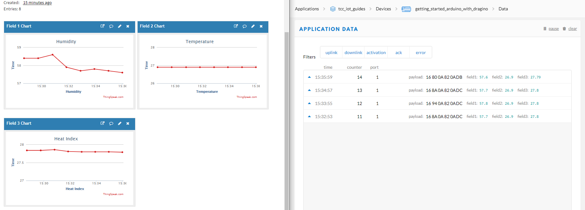

# ThingSpeak Guide (Temperature & Humidity with Arduino + Dragino Lora Shield)
Up until now the data we're generating, receiving and decoding is not being stored or used. While there are many options for this next step, this guide will look at using [ThingSpeak](https://thingspeak.com/)

This guide builds on the lessons learnt in the `Temperature & Humidity with Arduino + Dragino Lora Shield` and will make use of the application and device set up during the guide.

## What you will need
To follow along with this guide you will need not need any extra equipment. Just what you've already setup following the previous guides in this series.

Therefore it's **important** make sure you have your Arduino + Dragino + Temp/RH setup and transmitting to The Things Network, and that The Things Network is decoding the messages correctly!

## Step 1 - Set up ThingSpeak
In order to store and make use of our data we will be creating a channel using ThingSpeak.
1. First sign in to [ThingSpeak](https://thingspeak.com/)
    - Or create an account (you can "Get Started for Free").
1. After signing in, go to the My Channels page by clicking `Channels -> My Channels` on the top nav bar
1. Click the New Channel button
1. In the Name textbox enter an appropriate name like `Getting Started: Temperature & Humidity Sensor`
1. Ensure that the first 3 fields have a tick in their checkbox
1. In field 1 enter `Humidity`
1. In field 2 enter `Temperature`
1. In field 3 enter `Heat Index`
1. The rest of the options can be left blank for now so scroll to the bottom of the page and press the `Save Channel` button

This will take you to the private view of your new channel where you will have a graph for each of the fields, we entered earlier. Notice the `Channel ID`, you will need this in the next step!

Checkout the API Keys tab, you will need the Write API Key in the next step!!

## Step 2 - Connect ThingSpeak to The Things Network
Now that your  ThingSpeak account has been created, and channel has been set up,  The Things Network Application needs to send any data it receives to our new channel:
1. Sign into The Things Network
1. Go to `Console > Applications` and select the application that you want to connect to ThingSpeak
    - _This will be the application setup in the previous guides of this series._
1. Click on the `Integrations` heading
1. Click on the `add integration` button
1. Click on the `ThingSpeak` option
1. Enter a unique name for the integration process in the `Process ID` field
1. Copy the `Write API key` from the `API Keys` section of the ThingSpeak channel created in Step 1 into the `Authorization` field
1. Copy the `Channel ID` from the top of the ThingSpeak Channel created in Step 1 into the `Channel ID` field
1. Click `Add Integration`

## Step 3 - Success

All going well data should now appear on your graphs.

